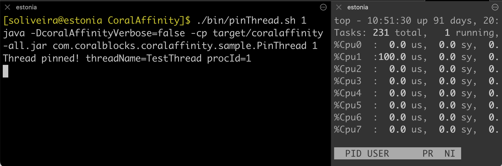

# CoralAffinity

Comprehensive and straightforward Linux thread affinity in Java so that you can pin your critical threads to isolated CPU cores for maximum performance. To pin a thread to a CPU logical processor id (or CPU core id) all you have to do is:

```java
int procId = 1;
Affinity.set(procId);
```

You can also set the affinity to more than one processor id and the kernel will decide where to pin the thread:

```java
int[] procIds = { 1, 2, 3 };
Affinity.set(procIds);
```

## Features

If you run the included script `./bin/cpuInfo.sh` you get:

<pre>
$ ./bin/cpuInfo.sh
java -cp target/coralaffinity-all.jar com.coralblocks.coralaffinity.CpuInfo

isEnabled: true
isAvailable: true
numberOfProcessors: 16 => procIds=0,1,2,3,4,5,6,7,8,9,10,11,12,13,14,15
physicalChips: Chip0, Chip1
processorsPerChip: Chip0=[0,1,2,3,4,5,6,7] Chip1=[8,9,10,11,12,13,14,15]
isHyperthreadingOn: true
hyperthreadedPairs: [0, 1], [2, 3], [4, 5], [6, 7], [8, 9], [10, 11], [12, 13], [14, 15]
cpuBitmasksFound: 9 => 64, 128, 192, 256, 320, 384, 448, 512, 1024 (in bits)
chosenCpuBitmaskSize: 64 bits
nonIsolatedCpuBitmask: 64515 (1111110000000011) => procIds=0,1,10,11,12,13,14,15
isolatedCpuBitmask: 1020 (1111111100) => procIds=2,3,4,5,6,7,8,9
</pre>

- _isEnabled_: You can easily disable CoralAffinity during testing and development through `-DcoralAffinityEnabled=false` or `export coralAffinityEnabled=false`.

- _isAvailable_: CoralAffinity automatically checks if it is available and can run in the machine it is being used. If it is not available your code will still run without any problems, like if CoralAffinity was disabled.

- _numberOfProcessors_: The number of logical processors in the machine. If the machine is using hyperthreading, the number of logical processors will be twice the number of physical CPU cores.

- _physicalChips_: The physical chips (microprocessors) present in the machine.

- _processorsPerChip_: The logical processors (processor ids) present in each of the physical chips.

- _isHyperthreadingOn_: If the machine is using hyperthreading, each physical CPU core will be able to run two threads at the same time.

- _hyperthreadedPairs_: With hyperthreading, each physical CPU core will have two logical processors. These are the pairs of logical processors per CPU core.

- _cpuBitmasksFound_: The different sizes (in bits) that can be used for the CPU affinity mask. `CoralAffinity supports up to 1024 logical processors and can be easily extended to support more.`

- _chosenCpuBitmaskSize_: The chosen CPU affinity mask size (in bits) to be used by CoralAffinity. This will always be greather or equal the number of logical processors, as each processor is represented by one bit.

- _nonIsolatedCpuBitmask_: The CPU mask and the processor ids that are _not isolated_ from the kernel scheduler. If no thread affinity is set, the kernel will execute the thread on one of these logical processors.

- _isolatedCpuBitmask_: The CPU mask and the processor ids that are _isolated_ from the kernel scheduler. The kernel scheduler will not touch these processors unless affinity is set.

## SchedResult

When calling the `Affinity.set(int ... procIds)` method, you can check its return value, which is the [Affinity.SchedResult](src/main/java/com/coralblocks/coralaffinity/Affinity.java#L39) object. See the example below:

```java
int procId = 1;

SchedResult schedResult = Affinity.set(procId);

if (schedResult.isOk()) {
	
   System.out.println("Thread pinned!" 
      + " threadName="+ Thread.currentThread().getName() 
      + " procId=" + procId);

} else {
	
   System.out.println("Could not pin thread!"
      + " threadName="+ Thread.currentThread().getName() 
      + " procId=" + procId
      + " schedResult=" + schedResult);
}
```

## Affinity.setSchedulableCpus()

You can use the method `setSchedulableCpus()` from [Affinity](https://github.com/coralblocks/CoralAffinity/blob/1b287c590a75ad7afef153877d3c3b364bbd0041/src/main/java/com/coralblocks/coralaffinity/Affinity.java#L159) to set the affinity mask to be any _non-isolated_ cpu core, in other words, cpu cores that are _schedulable_ by the kernel. Below we list this method documentation for reference:
```java
	/**
	 * Sets the thread affinity of the calling thread to be any schedulable CPU logical
 	 * processor which is not isolated from the kernel scheduler.
 	 * This method is useful when a thread which is already pinned to an isolated CPU
	 * logical processor wants to spawn a new thread but does not want this new thread
	 * to be pinned to the same isolated CPU logical processor, which is what happens
	 * by default.
	 * 
	 * @return a {@see SchedResult} object with the result of the call
	 */
	public synchronized static final SchedResult setSchedulableCpus();
```

## Testing

You can use the included script `./bin/pinThread.sh` to execute the sample [PinThread.java](src/main/java/com/coralblocks/coralaffinity/sample/PinThread.java) to test if CoralAffinity is working on your Linux machine.



**NOTE:** After running the `top` command on Linux, press `1` to see the list of logical processors.

## Isolating CPU Cores on Linux

This is done through the `isolcpus` kernel parameter. Below the basics:

#### 1. Identify Available CPU Cores
First, determine the CPU cores available on your system:
```sh
cat /proc/cpuinfo | grep processor
```

#### 2. Modify the Boot Loader Configuration
To isolate specific CPU cores, you need to add the `isolcpus` parameter to your kernel command line.

a) Open the GRUB configuration file:
   ```sh
   sudo vi /etc/default/grub
   ```
b) Find the line starting with `GRUB_CMDLINE_LINUX_DEFAULT` or `GRUB_CMDLINE_LINUX`.

c) Append the `isolcpus` parameter, specifying the core numbers you want to isolate. For example, to isolate cores 2 and 3:
   ```sh
   GRUB_CMDLINE_LINUX_DEFAULT="quiet splash isolcpus=2,3"
   ```
d) Save the file and update GRUB:
   ```sh
   sudo update-grub
   ```
   or, for some distributions:
   
   ```sh
   sudo grub-mkconfig -o /boot/grub/grub.cfg
   ```

#### 3. Reboot the System
Reboot for changes to take effect:

```sh
sudo reboot
```

#### 4. Verify CPU Isolation
After rebooting, check the isolated CPUs using:

```sh
cat /sys/devices/system/cpu/isolated
```

Alternatively, you can verify with:

```sh
cat /proc/cmdline
```


